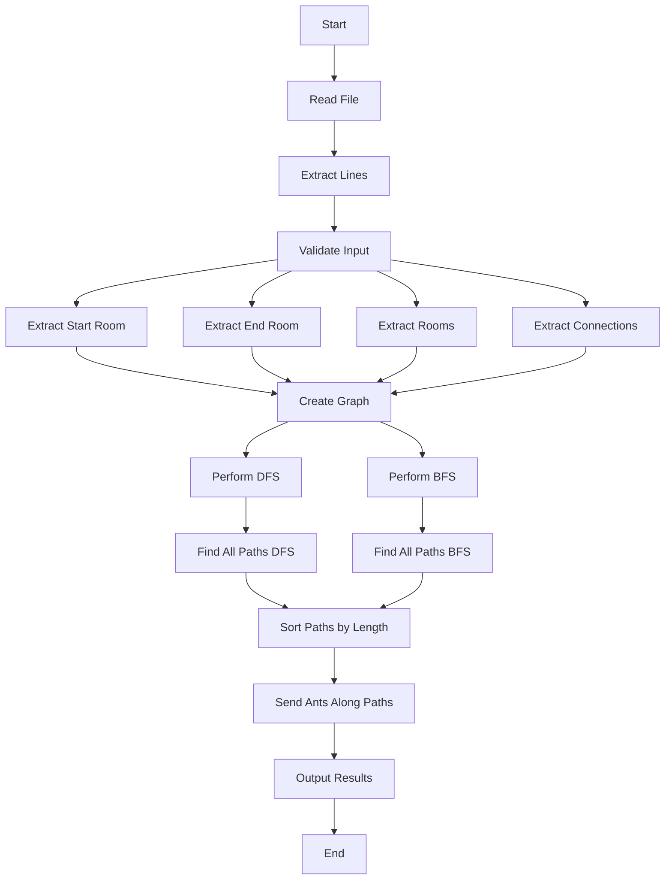

```mermaid
graph TD
    A[Start] --> B[Read File]
    B --> C[Extract Lines]
    C --> D[Validate Input]
    D --> E[Extract Start Room]
    D --> F[Extract End Room]
    D --> G[Extract Rooms]
    D --> H[Extract Connections]
    E --> I[Create Graph]
    F --> I
    G --> I
    H --> I
    I --> J[Perform DFS]
    I --> K[Perform BFS]
    J --> L[Find All Paths DFS]
    K --> M[Find All Paths BFS]
    L --> N[Sort Paths by Length]
    M --> N
    N --> O[Send Ants Along Paths]
    O --> P[Output Results]
    P --> Q[End]
```
